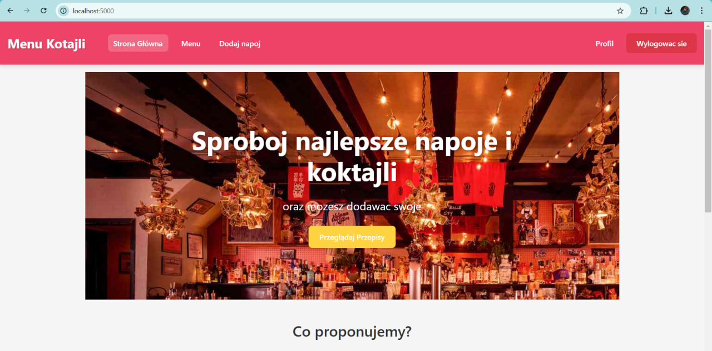
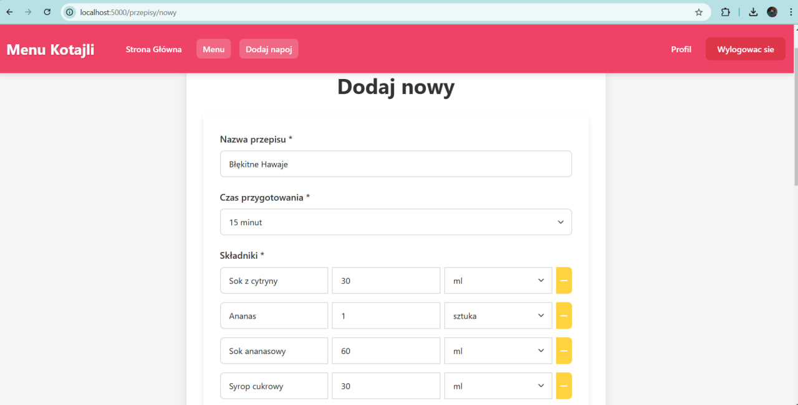
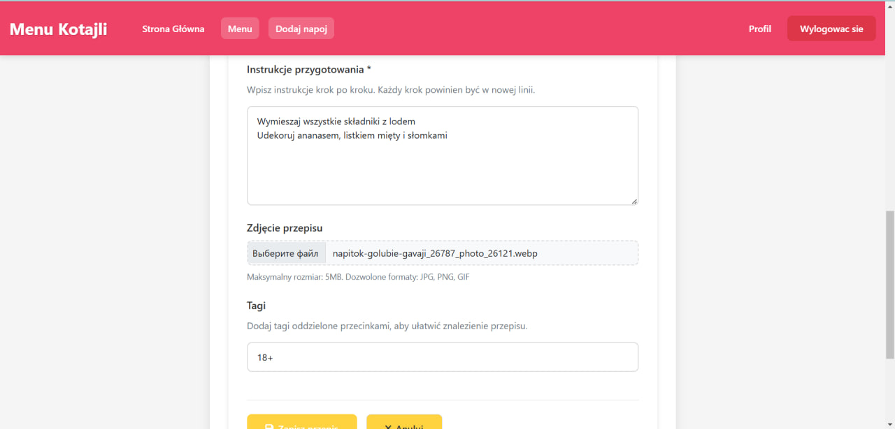
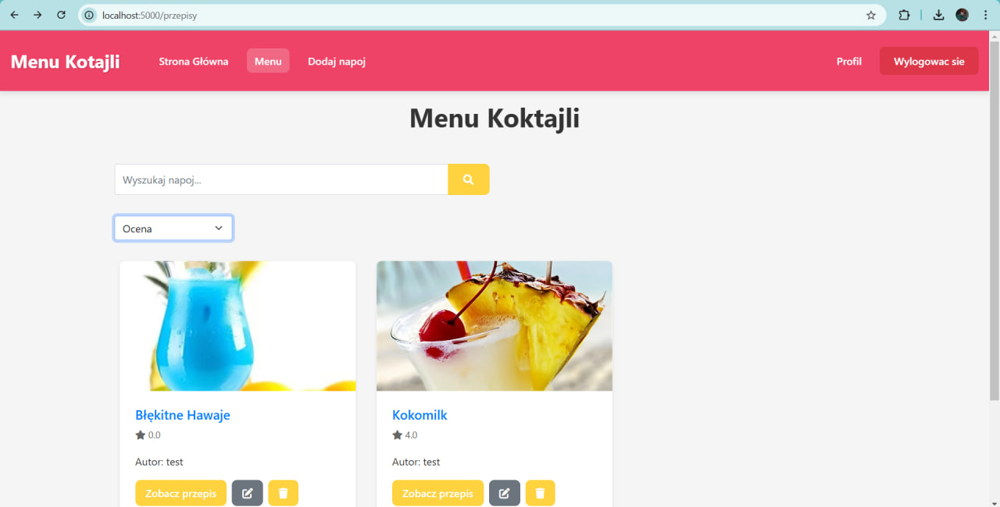
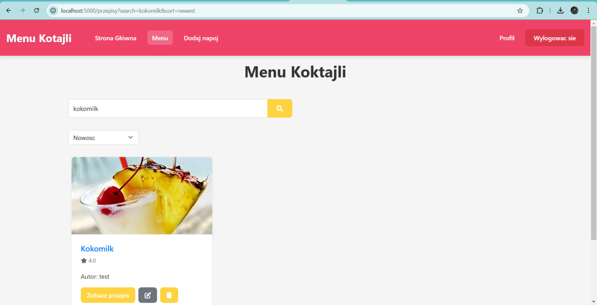
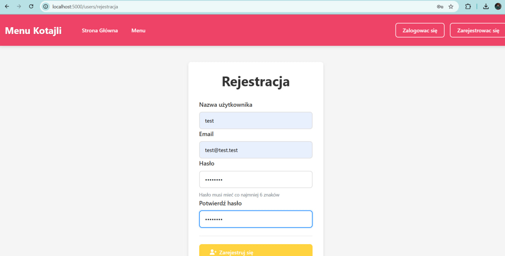
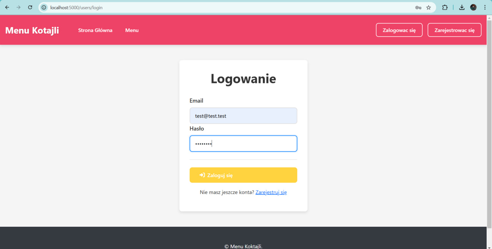

## ⚙️ Instalacja i start projektu

### ✅ Co musisz mieć zainstalowane:

* Node.js w wersji co najmniej 14
* npm (zarządca paczek)
* MongoDB (może być lokalna instancja lub zdalna)

### 🔧 Jak uruchomić aplikację:

1. **Pobierz projekt na swój komputer:**

```bash
git clone https://github.com/hwanlix/Kolekcja-ulubionych-przepis-w-do-koktajli.git
```

2. **Zainstaluj wszystkie wymagane moduły:**

```bash
npm install
```

3. **Utwórz plik `.env` i wprowadź w nim konfigurację środowiskową:**

```
MONGODB_URI=
SECRET_KEY="tu_wstaw_swoj_klucz"
PORT=5000
```

4. **Uruchom serwer:**

```bash
npm start
```










Po pomyślnym uruchomieniu, aplikacja powinna być dostępna lokalnie pod adresem:
👉 `http://localhost:5000`